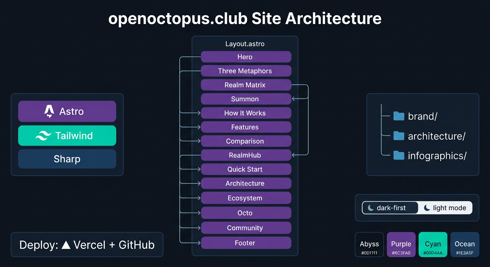

<p align="center">
  
</p>

<h3 align="center">openoctopus.club</h3>

<p align="center">
  Official landing page for <a href="https://github.com/open-octopus/openoctopus">OpenOctopus</a> — the realm-native life agent system.
</p>

<p align="center">
  <a href="https://openoctopus.club">
    
  </a>
  <a href="https://github.com/open-octopus/openoctopus">
    
  </a>
  <a href="https://discord.gg/openoctopus">
    
  </a>
</p>

---

## Tech Stack

| Layer | Choice |
|---|---|
| Framework | [Astro](https://astro.build/) (static output) |
| Styling | [Tailwind CSS](https://tailwindcss.com/) v3 |
| Images | Astro Image (sharp, auto WebP) |
| Fonts | Inter, JetBrains Mono, Noto Sans SC (Google Fonts CDN) |
| Deploy | [Vercel](https://vercel.com/) + GitHub integration |
| Domain | [openoctopus.club](https://openoctopus.club) |

## Development

```bash
pnpm install
pnpm dev        # localhost:4321
pnpm build      # static output → dist/
pnpm preview    # preview built site
```

## Structure

<p align="center">
  
</p>

```
src/
├── assets/brand/         # Logo, mascot, banner, generated images
├── assets/architecture/  # Architecture diagrams
├── assets/infographics/  # Infographic images
├── components/           # 16 Astro components (14 sections + Header/ThemeToggle)
├── layouts/Layout.astro  # Base HTML with SEO meta, OG, fonts, theme init
├── pages/index.astro     # Single-page landing (assembles all components)
└── styles/global.css     # Tailwind base + brand utilities (.card, .btn-*, .gradient-text)
```

### Sections

Hero → Three Metaphors → Realm Matrix → Summon → How It Works → Features → Comparison → RealmHub → Quick Start → Architecture → Ecosystem → Octo → Community → Footer

## Theme

Dark-first (deep sea). Light mode via toggle. Uses custom Tailwind `light:` variant.

Brand colors: `#0D1117` Abyss · `#6C3FA0` Purple · `#00D4AA` Cyan · `#1E3A5F` Ocean

## License

MIT
